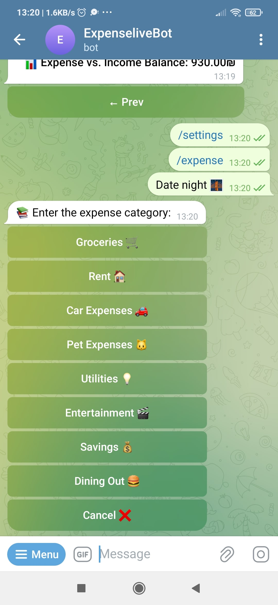
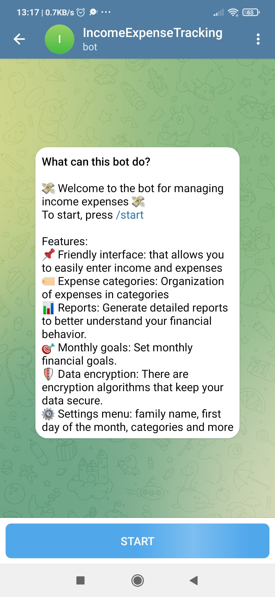
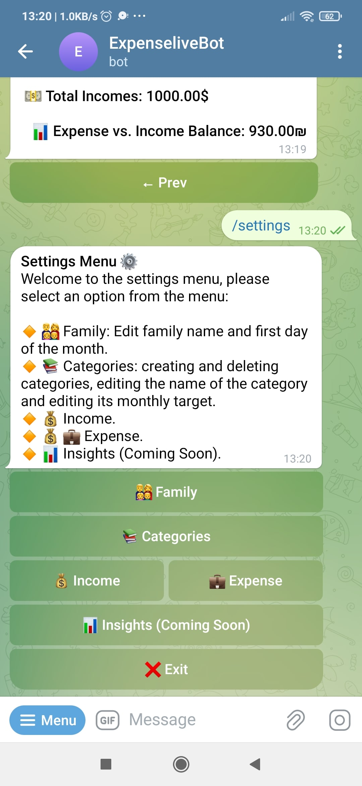
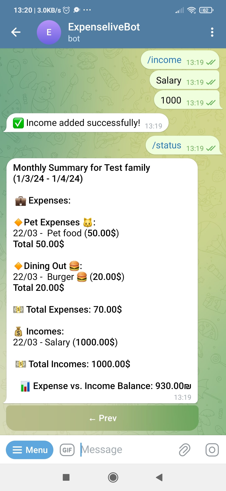

# Income Expense Tracking Bot 🤖💰

Welcome to the first fully functional release of the Income Expense Tracking Bot, a dynamic tool designed to meticulously track and manage both income and expenses for personal and business accounting. With an easy-to-use Telegram bot interface, comprehensive financial data categorization, and insightful report generation, this bot is your indispensable companion in achieving a deep understanding of your financial situation.

## Features 🚀

1.  📌 **User-Friendly Interface:** A simplistic and intuitive Telegram interface allows users to easily input income and expenses.
2.
3.  🏷️ **Categorization:** Organize your income and expenses into diverse categories for a clearer overview of your financial life.
4.
5.  🧮 **Automated Calculations:** Automatically calculates total income, expenses, and the net balance, saving you time and preventing errors.
6.
7.  📊 **Reports:** Generate detailed reports to analyze your income and expense patterns. The bot provides a range of customizable reports to help you understand your financial behavior better.
8.
9.  🎯 **Monthly Targets:** Set monthly financial goals and track your progress towards achieving them with real-time updates.
10.
11. 🌐 **Multi-Language Support:** Supports multiple languages, making it accessible to non-English speakers. Choose your preferred language for a personalized experience.
12.
13. 🛡️ **Data Encryption:** Implements encryption algorithms to keep your data secure and private.
14.
15. ⚙️ **Customizable Settings:** Adjust settings according to your preference. Choose your preferred currency, date format, and more.
16.
17. 📆 **Monthly Expenses:** Option to add a recurring expense every month.
18.
19. ✏️ **Editing and Deleting Entries:** Functionality to edit or delete particular income or expense entries for greater control over your data.
20.
21. 💸 **Dividing Expenses into Installments:** Divide a large expense into smaller, manageable installments for a more accurate representation of your expenditure.

## Future Features 🕰️

The journey of enhancing the Income Expense Tracking Bot continues, with ambitious plans for future versions:

-   **API Access:** An upcoming feature is the introduction of an API for free use, empowering developers and businesses to integrate and extend the bot's capabilities within their systems.

## Installation 🛠️

```bash
# Clone the repository
git  clone  https://github.com/IdanSHR/IncomeExpenseTracking.git

# Navigate into the directory
cd  IncomeExpenseTracking

# Install the required dependencies
npm  install
```

After cloning and installing the dependencies, configure the bot by providing the necessary credentials and settings.

## Usage 🖥️

```bash
# Run the bot
npm  start
```

Open the bot in your web browser at `http://localhost:3000` and follow the on-screen instructions to embark on your financial management journey!

## Screenshots 📸

<div style="display: grid; grid-template-columns: repeat(2, 1fr); grid-gap: 20px;">



 </div>

## Technologies Used 👨‍💻

-   **Programming Language:** JavaScript (Node.js)
-   **Frameworks or Libraries:** Express.js, Moment.js, node-cron
-   **Database:** MongoDB
-   **APIs or External Services:** Telegram Bot API (node-telegram-bot-api)

## Extendable to Front-end Applications 🔄

This bot is built to be robust, flexible, and extendable, inviting developers to construct front-end applications that leverage its comprehensive back-end functionalities.

## Contributing 🤝

We welcome your contributions to make the Income Expense Tracking Bot even better. Whether it's adding new features, fixing bugs, suggesting improvements, or helping with documentation, your involvement is highly appreciated.

## License 📜

This project is licensed under the MIT License - see the [LICENSE](LICENSE.txt) file for details.

## Contact 📞

<a  href="https://www.buymeacoffee.com/idanshr"  target="_blank"></a>
Idan Shasha Rain - I'm always open to discussions, questions, or suggestions. Feel free to reach out!
[LinkedIn](https://www.linkedin.com/in/idanshasha/)
